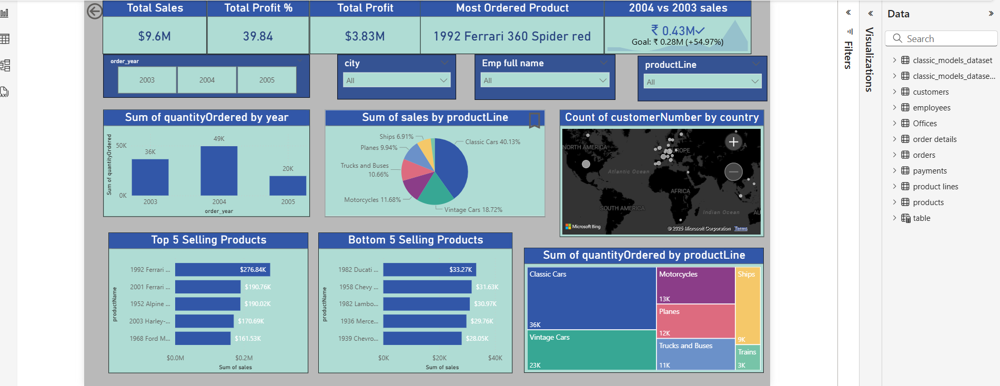
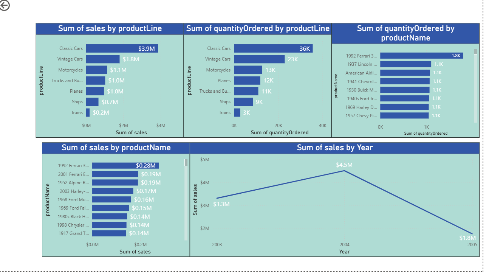
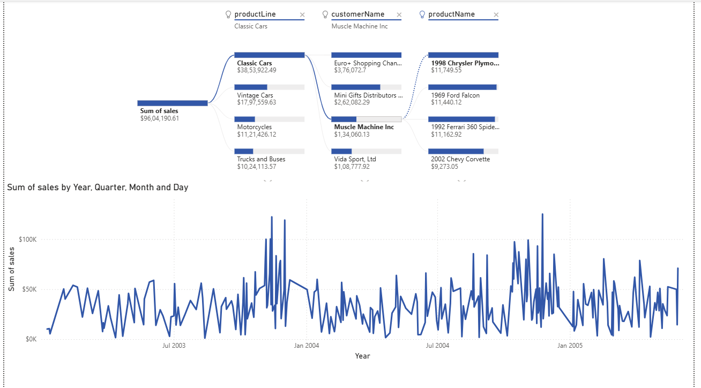

# 🚀 Sales Dashboard & Performance Insights using Power BI

This project showcases a comprehensive sales analysis dashboard built using **Power BI**, leveraging datasets related to customers, employees, orders, and products. The goal was to provide dynamic, interactive insights into company performance across time, geography, and product lines.

---

## 📊 Project Overview

The dashboard allows stakeholders to explore:

- **Total Sales, Profit, and Most Ordered Products**
- **Sales Performance Comparison by Year**
- **Top and Bottom 5 Products by Sales**
- **Geographic Distribution of Customers**
- **Sales Breakdown by Product Line**
- **Trends in Quantity Ordered and Sales Over Time**

---

## 🧰 Tools & Technologies

- **Power BI** – Data visualization and dashboard development  
- **Microsoft Excel / CSV** – Initial data sources  
- **Power Query** – Data transformation and cleaning  
- **DAX (Data Analysis Expressions)** – Custom calculations and KPIs  
- **Classic Models Dataset** – Simulated company sales data  

---

## 📂 Datasets Used

- `customers`  
- `employees`  
- `orders` & `order details`  
- `payments`  
- `products`  
- `product lines`

---

## ✅ Key Features Implemented

- 📈 **KPI Cards**: Total Sales, Profit %, Most Ordered Product, and YoY growth (2004 vs 2003)  
- 📅 **Time-Based Analysis**: Sales and quantity trends by Year, Quarter, Month, and Day  
- 🌍 **Map Visualization**: Global distribution of customers using Power BI Maps  
- 📊 **Bar & Pie Charts**:
  - Sum of quantity ordered by year
  - Sales distribution by product line
  - Top/Bottom 5 selling products  
- 🌐 **Drill-down Filters & Slicers**: Dynamic filtering by city, product line, employee, and time  
- 🔄 **Dynamic Interaction**: Visual elements are fully interactive and respond to user input  

---

## 📸 Dashboard Snapshots

> You can insert images here after uploading them to GitHub using:
```md



